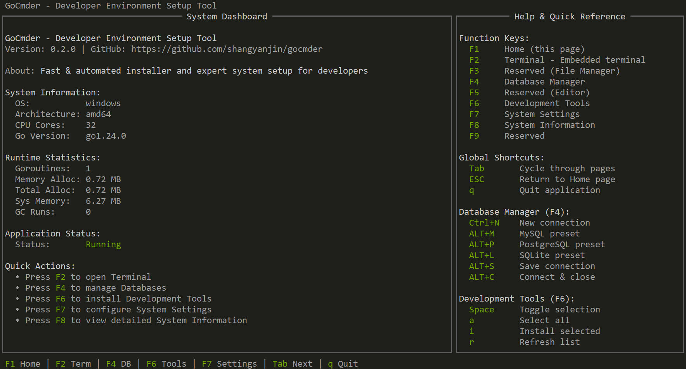

# gocmder

GoCmder is a cross-platform terminal UI application for developers to rebuild their environment after system reinstall. It provides an interactive dashboard for installing Git, VSCode, Go, Node, PgSQL, MySQL, Redis, and configuring system settings.

## Screenshots



*Main dashboard showing system information and help panel*

## Features

- **Interactive TUI Dashboard**: Terminal-based user interface with system information and help panel
- **Developer Tools Installation**: One-click installation of development tools (Git, VSCode, Go, Node.js, PostgreSQL, MySQL, Redis)
- **Database Management**: Connect to databases, execute SQL queries, browse tables
- **System Configuration**: Automated PATH setup, power settings, and personal folders
- **Multi-platform Support**: Windows (primary), macOS and Linux (planned)
- **ESC Key Navigation**: Global ESC key to return to home page from any page
- **Keyboard Shortcuts**: Comprehensive shortcut support for efficient navigation
- **Real-time System Info**: CPU, memory, and runtime statistics display

## Components

### 1. Go Application (`main.go`)

The main interactive application with TUI interface:

- **System Dashboard**: Real-time system information and runtime statistics
- **Help Panel**: Comprehensive keyboard shortcuts and usage guide
- **Multi-page Navigation**: F1-F9 function keys for page switching
- **Database Manager**: Connection dialogs with preset shortcuts (ALT+M/P/L/S/C)
- **Development Tools**: Interactive tool installation interface
- **System Settings**: Configuration management with PATH and power settings
- **ESC Navigation**: Global ESC key to return to home page
- **Logging System**: Comprehensive logging with file output

### 2. Shell Scripts (`/scripts`)

Traditional shell and PowerShell scripts for quick setup:

- **Windows**: Run `scripts/win/Set-PersonalFolders.ps1` or `scripts/win/Install-DevTools.ps1`
- **macOS**: Run `scripts/macos/set-personal-folders.sh`
- **Linux**: Run `scripts/linux/set-personal-folders.sh`

## Installation

### Build from Source (Recommended)

**Prerequisites:**
- Go 1.21 or higher
- Git

**All Platforms (Windows / Linux / macOS):**

```bash
# Clone the repository
git clone https://github.com/shangyanjin/gocmder.git
cd gocmder

# Download dependencies
go mod download

# Build the application
go build -o gocmder .
```

**Windows:**
```powershell
# Build for Windows
go build -o gocmder.exe .

# Run
.\gocmder.exe
```

**macOS / Linux:**
```bash
# Build the application
go build -o gocmder .

# Run
./gocmder
```

## Usage

### Keyboard Navigation

**Function Keys:**
- `F1` - Home (System Dashboard)
- `F2` - Terminal
- `F4` - Database Manager
- `F6` - Development Tools
- `F7` - System Settings
- `F8` - System Information

**Global Shortcuts:**
- `ESC` - Return to Home page
- `Tab` - Cycle through pages
- `q` - Quit application

**Database Manager Shortcuts:**
- `Ctrl+N` - New connection
- `ALT+M` - MySQL preset
- `ALT+P` - PostgreSQL preset
- `ALT+L` - SQLite preset
- `ALT+S` - Save connection
- `ALT+C` - Connect & close

### Choose your preferred method:

**Option 1: Shell Scripts (Quick)**
- Windows: `scripts/win/Set-PersonalFolders.ps1`
- macOS: `scripts/macos/set-personal-folders.sh`
- Linux: `scripts/linux/set-personal-folders.sh`

**Option 2: GoCmder (Interactive)**
- Build and run the Go application for an interactive dashboard experience

## Project Structure

```
gocmder/
├── main.go                    # Application entry point
├── internal/                  # Core business logic
│   ├── bootstrap/            # Application initialization
│   ├── config/               # Configuration management
│   ├── detect/               # System detection
│   ├── installer/            # Tool installation logic
│   ├── logger/               # Logging system
│   ├── models/               # Data models
│   ├── setup/                # Setup utilities
│   └── ui/                   # User interface components
│       ├── uiapp.go          # Main UI application
│       ├── components/       # Reusable UI components
│       │   └── dialogs/      # Dialog components
│       ├── pages/            # Application pages
│       │   ├── home/         # System dashboard
│       │   ├── database/     # Database manager
│       │   ├── terminal/     # Terminal emulator
│       │   ├── tools/        # Development tools
│       │   ├── settings/     # System settings
│       │   └── system/       # System information
│       ├── style/            # UI styling
│       └── utils/            # UI utilities
├── scripts/                   # Shell/PowerShell scripts
│   ├── win/                  # Windows scripts
│   ├── macos/                # macOS scripts
│   └── linux/                # Linux scripts
├── docs/                      # Documentation
│   ├── screenshot/           # Application screenshots
│   └── CHANGELOG.md          # Version history
├── downloads/                 # Installer downloads
├── backups/                  # User backups
├── logs/                      # Application logs
├── README.md                  # This file
├── LICENSE                    # License
└── go.mod                     # Go module definition
```

## ⚠️ Disclaimer

**THIS IS A BETA/TEST VERSION - NOT FOR PRODUCTION USE**

- This software is provided "AS IS" without warranty of any kind
- No guarantees of reliability, security, or data integrity
- Use at your own risk - the author assumes no liability for any damages
- Recommended for testing and development environments only
- Always backup your data before use

## Repository

- **GitHub**: [https://github.com/shangyanjin/gocmder](https://github.com/shangyanjin/gocmder)

## Documentation

- [CHANGELOG](docs/CHANGELOG.md) - Version history and development notes
- [UI Architecture](docs/UI_ARCHITECTURE.md) - User interface architecture documentation
- [UI Structure](docs/UI_STRUCTURE.md) - User interface structure documentation
- [Screenshots](docs/screenshot/) - Application screenshots
- [Shell Scripts](scripts/) - Traditional automation scripts

## Author

Maintained by [shangyanjin](https://github.com/shangyanjin)
